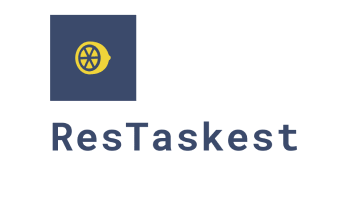

<p align="center">
    
</p>
<h2 align="center">ResTaskest: Restaurant Tasks Done Fastest</h2>
<h3>Our API live <a href="https://github.com/tylrtnguyen/restaskest-rest-api" target="_blank">here</a></h3>

### Team: Plus 84
| Team Member | Role |
| ----------- | -----|
| [Thong Nguyen](https://github.com/tylrtnguyen) | Lead Full Stack Developer |
| [Quang Pham](https://github.com/quangpham919) | Front-End Developer |
| [Thanh Quan](https://github.com/ThomasQuan) | Mobile Developer |
| [Tu Nguyen](https://github.com/tunguyen912) | Mobile Developer |

## :wrench: Built with
- [Angular.js](https://angular.io/)
- [MongoDB](https://www.mongodb.com/)
- [Angular Meterial UI](https://material.angular.io/)
- [Moment.js](https://momentjs.com/)
- [Highcharts.js](https://www.highcharts.com/)

## 🚀 Quick start
1. **Install Node.js using NVM.**
  ```shell
  nvm install node
  ```
2. **Install Angular CLI.**
   ```shell
   npm install -g @angular/cli
   ```
3. **Install project dependencies.**
   ```shell
   npm install
   ```
4. **Run in development mode**
   ```shell
   npm run start
   ```

## 💫 Build and Deploy for Production
1. **Build a optimized version for production**
   ```shell
   npm run build
   ```

<h4>Developed and maintained by Plus84 Team</h4>